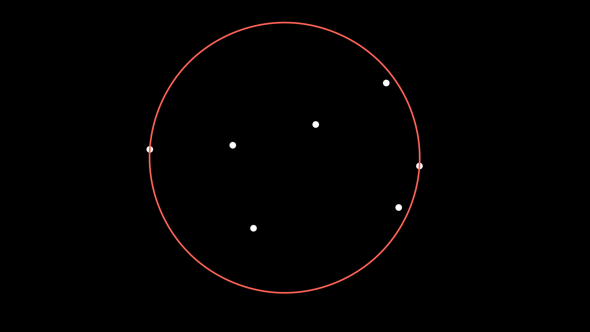

# Welzl's Minimum Enclosing Circle Algorithm

## Introduction

Welcome to my submission to the Summer of Math Exploration 1. I want to share with you one of my favorite algorithms, Welzl's minimum enclosing circle algorithm.

I'm sharing this because I believe the algorithm is particularly nice and elegant. But also believe it hightlights some great problem solving principles needed to discover it.

## Problem Statement

The problem statement is as follows:

> Given $n$ points in the plane, find the circle with minimum radius which encloses all the points.

For example, this is the minimum enclosing circle for the following set of points.

### Why does this matter?

You may ask, what might you care about this problem?

What if you wanted to build a hospital and minimize the maximum distance to residents of a community. The minimum enclosing circle would give you a reasonable place to build such a hospital.

Perhaps you want to approximate if a point is close to any point in some set. You could first compare against the minimum enclosing circle instead of comparing points individually. Or perhaps you want to approximate the maximum distance between two points in a set. In this case, the diameter of the minimum enclosing circle would be a good approximation.

But also if you're reading this, hopefully you would care about the problem solely for the interesting algorithm.

Maybe if you've seen some computational geometry before, you have ideas of how to start. If you've never seen the problem before, I highly encourage you to take a few minutes to mess around and see if you can come up with any ideas before reading ahead.

## Initial Observations

Even though it may not be obvious how to solve this, a good problem solving strategy is to try to note any observations we can find in our initial investigation.

Perhaps you ask yourself:

> How many points are on the boundary of the minimum enclosing circle?

Well we can first observe: if there were $0$ points on the boundary, then the circle could just be made smaller. For example, we could shrink the circle around the same center until at least one point is on the boundary of the circle.

Since this would always result in a smaller circle as we can see above, this means that no minimum enclosing circle could have $0$ points on the boundary of the circle.

What if there was exactly one point on the boundary of the circle. Then we could shrink the circle around the single point as the origin until there is another point on the boundary of the circle.

So now we can conclude that there must be at least two points on the boundary of the minimum enclosing circle. But can there be exactly two points on the boundary? Well if we imagine shrinking the circle around the midpoint between the two fixed points, the circle would continue to get smaller until one of two things happen. Either the circle cannot get any smaller or a third point is now on the boundary of the circle.

For example, in the example we have been using, we can see that after doing this, the circle now has the two fixed points on the diameter of the circle.

The other case can be seen in the following example, where the circle ends up with three points on the boundary of the circle.

TODO: example

## Naive Algorithm

Thus far, we have concluded if the minimum enclosing circle has two points on the boundary, they are on the diameter of the circle. Otherwise there must be at least three points on the boundary of the circle. If there are more than three points, note that it only takes exactly three points to determine a circle. Thus if we are interested in trying all possible circles, we only need to worry about trying sets of at most $3$ points.

This gives us an algorithm: if we try all sets of $2$ to $3$ points and determine the circle that goes through them given the above conditions, we can take the circle of minimum radius which also encloses all other points. However this algorithm is pretty naive, but would be correct. When describing the runtime we would say this algorithm runs in $O(n^4)$ time. This is because there are $O(n^3)$ sets of points we have to try and for each one we have to check if all other $n$ points are within the circle.

Note, the notation $O(f(n))$ indicates that the runtime of the algorithm grows at most as fast as $f(n)$ grows. Thus when we say the algorithm is $O(n^4)$, it means it grows no faster than $n^4$, i.e. if we double the input, the runtime should at most be $16$ times larger. And we also assume this asymptotically, i.e. as $n$ goes to infinity this holds.

For this problem, we would hope we can get something much closer to $O(n)$. And in fact as we will see Welzl's algorithm does end up running in expected $O(n)$ time.

